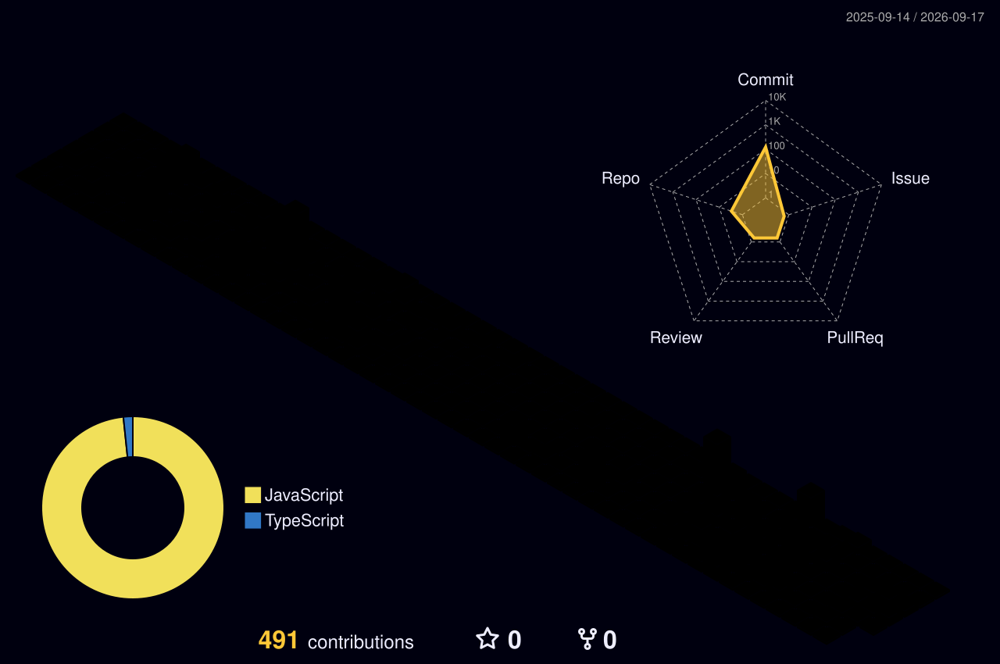

  

<h3 align="center">Full-stack Developer | Cloud & Automated Deployment</h3>

  

  

### 🛠️ Tech Stack

  
  
  
  
  
  
  
  
  
  
  
  
  
  
  
  

### 💻 IDEs & Development Tools

  
  
  
  
  

### 📊 GitHub Stats

 
   

